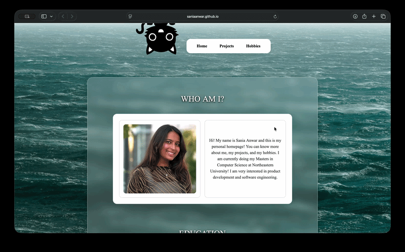
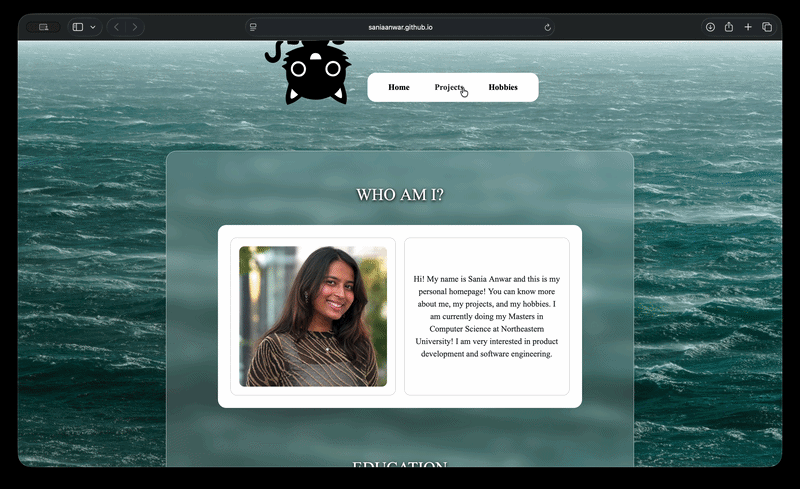
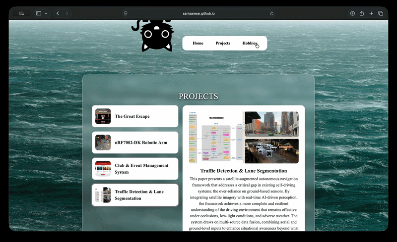

# Sania Anwar - Personal Homepage (CS5610 Web Development)

This is a three-page personal homepage which was built with vanilla HTML5, CSS3 and ES6+ modules. It has a home page about me and my education, my projects, and an interactive hobbies page about photography.

**Live site:** https://saniaanwar.github.io/CS5610-Homepage-SaniaAnwar/

## Project Objective

This is Project 1 for CS 5610 (Web Development). The goal was to build a front-end-only homepage (with no backend, no jQuery and no component libraries). We had to add one creative element that makes it different from other homepages. I wanted a page that a recruiter, a classmate or a professor could open and quickly find who I am, what I've built, and how to contact me.

## Class

- **Course:** [CS 5610: Web Development](https://johnguerra.co/classes/webDevelopment_online_fall_2026/), Khoury College of Computer Sciences, Northeastern University
- **Instructor:** John Alexis Guerra Gomez

## Demo Video

[Watch a demo video here!](https://youtu.be/wYR5GOQtKh4)

## Pages

- **Home (`index.html`):** a short intro about me, my education, and contact links (GitHub, LinkedIn, email).
  
- **Projects (`projects.html`):** a list of my four most recent projects. When you click a project, it shows its details on the right.
  
- **Hobbies (`hobbies.html`):** a page about my hobby of photography. When you click the button on the camera, it slides it over and shows two film strips of my photos. Clicking the photo in the film strip shows it on the camera's screen. This page was generated with AI ([Use of Generative AI](#use-of-generative-ai)).
  

## Creative Additions

- **The camera on the hobbies page:** the button on the camera opens the film strips, and each photo can be shown on the camera screen. This is interactive!
- **The project details:** When you click a project on the projects page, it shows its image and description on the same page. I wrote this JavaScript myself in `js/projects.js`.
- **The cat:** the cat at the top drops in whenever a page loads. This is a small CSS animation.

## Technologies Used

- HTML5, CSS3, JavaScript (ES6+ modules, no libraries)
- [Bootstrap 5.3.3](https://getbootstrap.com/), loaded from a CDN, for the layout grid. The styling is my own CSS.
- [Google Fonts](https://fonts.google.com/) (Caveat) on the hobbies page
- ESLint 10 and Prettier 3, for linting and formatting (development tools only)
- GitHub Pages, for deployment

## Requirements

- A modern web browser
- A local web server (see below), because ES modules don't load when `index.html` is opened directly from the file system
- Node.js 20.19 or newer, only if you want to run the lint and format tools

## How to Install and Run

1. Clone the repository:

   ```
   git clone https://github.com/saniaanwar/CS5610-Homepage-SaniaAnwar.git
   cd CS5610-Homepage-SaniaAnwar
   ```

2. Install the development tools (optional, only needed for linting and formatting):

   ```
   npm install
   ```

3. Start a local server from the project folder. Either use the **Live Server** extension in VS Code, or run:
   ```
   python3 -m http.server 8000
   ```
   then open http://localhost:8000 in your browser.

### Useful commands

```
npm run lint          # to check the JavaScript with ESLint
npm run format        # to format all files with Prettier
npm run format:check  # to check the formatting without changing files
```

## Project Structure

```
.
├── index.html
├── projects.html
├── hobbies.html
├── css/
│   └── style.css
├── js/
│   ├── main.js        # imports the two modules below
│   ├── projects.js    # detailed project descriptions
│   └── hobbies.js     # camera and film strips
├── images/
├── docs/              # design document and screenshots
├── eslint.config.js
├── package.json
└── LICENSE
```

## Design Document

The project description, personas, user stories and wireframes are in the [design document](docs/design-document.pdf).

## Use of Generative AI

I used generative AI for the third page of my project which was for hobbies.

- **Tool, model and version:** Claude Sonnet 5
- **How it was used:** the AI generated the hobbies page's HTML, its CSS (the camera, film strips and animations, which are in the hobbies section of `css/style.css`) and its JavaScript (`js/hobbies.js`).
- **Prompts:** My first prompt was giving it a plan about how I wanted the page to be structured (camera on the left side and photos on right). I also explained how I wanted the mechanism to work the way I wanted it to. It asked me exactly how I wanted the button clicking to be set since I had uploaded my own camera image. One thing that AI was able to do without me explaining was show the preview of the image on the camera screen when you click it. I had uploaded a picture with a blank screen and it was able to preview the picture there which was quite interesting!

- **What I did:** I gave it all the pictures that needed to be added, along with the camera picture. It also took a little back and forth to get the button clicking mechanism since it wasn't able to put everything exactly where I wanted it to be.

## Credits

- Camera image: [Pinterest](https://www.pinterest.com/pin/726275877450769233/)
- Background image: [Unsplash](https://unsplash.com/photos/a-large-body-of-water-with-a-boat-in-the-distance-1VNkq9PWv8w)
- GitHub icon: [Wikipedia](https://en.wikipedia.org/wiki/GitHub)
- LinkedIn icon: [Wikipedia](https://en.wikipedia.org/wiki/LinkedIn)
- Email icon: [Wikipedia](https://en.wikipedia.org/wiki/Microsoft_Outlook)
- NU logo: [Wikipedia](https://en.wikipedia.org/wiki/Northeastern_University)
- VIT logo: [Wikipedia](https://en.wikipedia.org/wiki/Vellore_Institute_of_Technology)
- Cat image: [Creazilla](https://creazilla.com/media/clipart/17836/friendly-kitten)
- Picture of me, project photos, hobby photos: taken by me.
- Bootstrap: https://getbootstrap.com/
- Caveat font: Google Fonts

## Author

**Sania Anwar**, Master's in Computer Science at Northeastern University

- Homepage: https://saniaanwar.github.io/CS5610-Homepage-SaniaAnwar/
- GitHub: https://github.com/saniaanwar
- LinkedIn: https://www.linkedin.com/in/sania-anwar/

## License

This project is licensed under the [MIT License](LICENSE).
